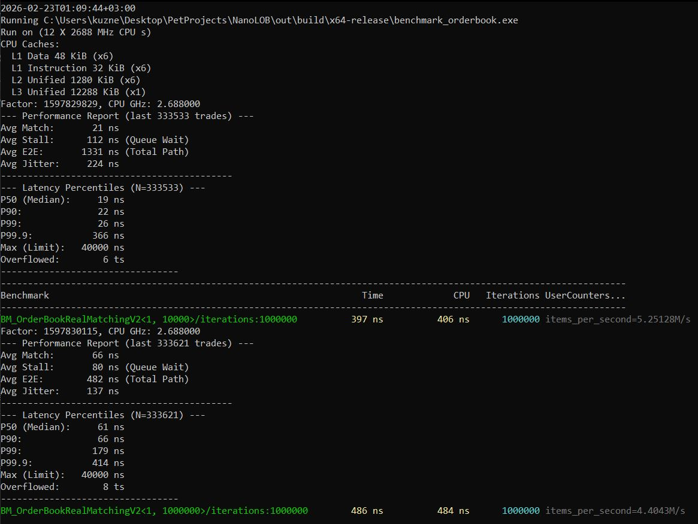
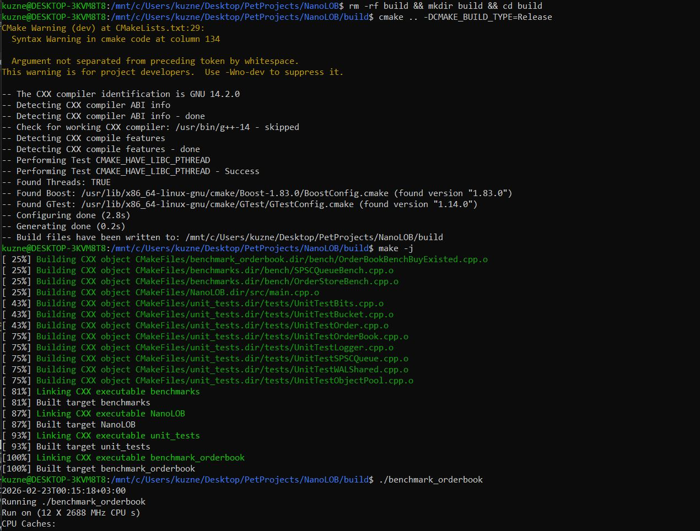

# NanoLOB - Ultra-Low Latency Limit Order Book
High-performance matching engine in C++23, achieving sub-100ns core latency on a million price levels.

## 1. Key Performance

> Environment: 11th Gen Intel(R) Core(TM) i5-11400H @ 2.70GHz, MSVC (Release mode), Windows/WSL2.



**Note on Benchmarking**: The report shows two consecutive runs. The first (10k levels) serves as a CPU warm-up, stabilizing frequency and caches. The second run demonstrates the engine's performance on 1,000,000 price levels, maintaining sub-microsecond P99.9 latency.

## 2. Architecture & Design Decisions
* `boost::intrusive::list` for the price buckets and `absl::flat_hash_map`: Provide amortized O(1) "add", "delete", "find"
* Hierarchical Bitsets: Used for best-price discovery. Optimized for L1/L2 cache residency.
* Zero-Allocation Path: No dynamic memory allocation in the hot loops (Object Pooling & Static Arrays).
* Asynchronous Pipeline:
`OrderBook -> [SPSC] -> Logger -> [SPSC WAL] -> Outputer`
* Lock-free Primitives: Custom SPSC queues for minimal inter-thread jitter.
* Mechanical Sympathy: Explicit cache-line alignment (`alignas(64)`) and branch prediction hints (`[[likely]]`).

## 3. Benchmarking Methodology
* Measured using TSC (Time Stamp Counter) with serialization barriers (rdtscp) to eliminate out-of-order execution noise.
* Ticks are converted to nanoseconds only in the Outputer to minimize hot-path overhead

## 4. Build-time Configuration (CMake)
```
add_compile_definitions(MAX_ORDERS=2'100'000ULL) # Pre-allocated memory
add_compile_definitions(NANOSECONDS_PER_STATS_SNAPSHOT=2*10'000'000'000ULL) # Telemetry interval
add_compile_definitions(RESET_WAL_FILES=true) # Continue read where program stopped earlier
add_compile_definitions(CLEAR_LOGGER_STATS_AFTER_SNAPSHOT=false) # False if you want to see full statistics
```

## 5. How to Run
```bash
mkdir build && cd build
cmake .. -DCMAKE_BUILD_TYPE=Release
make -j
./benchmark_orderbook
```
#### Build & Benchmark Run Proof


## 6. Dependencies
This project uses the following libraries:
* [Abseil (Google)](https://github.com/abseil/abseil-cpp) - Used `absl::flat_hash_map` for O(1) order tracking.
* [Boost.Intrusive](https://www.boost.org) - Used for zero-allocation intrusive lists in price buckets.
* [Google Benchmark](https://github.com/google/benchmark) - Microbenchmarking framework for latency measurements.
* [Google Test](https://github.com/google/googletest) - Unit testing and verification.